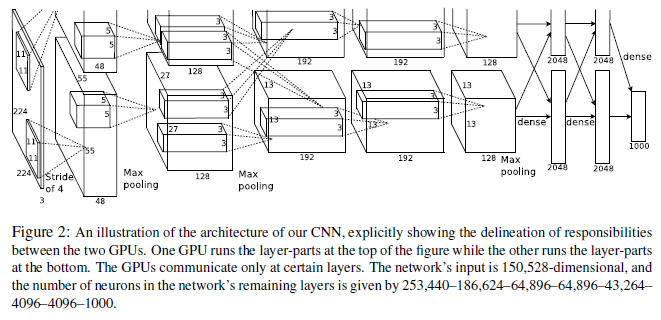
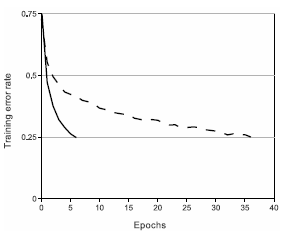
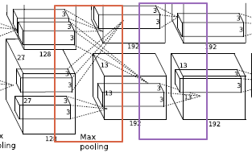

Author: pulpan92

# AlexNet

## 1. Introduction
- - -

AlexNet 이전의 CNN 모델에서는 고해상도 이미지에 적용을 할 때는 상당한 비용이 소요되었다. 따라서 AlexNet에서는 `ILSVRC-2010`, `ILSVRC-2012` 대회에서 사용된 ImageNet 집합에 대해 CNN을 훈련시켰으며 이전 모델들에 비해서 최고의 성능을 내었다. 

학습 시간은 `GTX 580 3GB GPU` 2대를 사용하여 5~6일정도가 걸린다.

## 2. Dataset
- - -

Dataset으로 사용된 ImageNet은 총 1500만개의 이미지이며 Crowd-sourcing을 이용해 사람이 분류한 22,000가지의 카테고리로 나뉘게 된다. 이중 AlexNet에 사용된 ILSVRC 데이터셋의 구성은 다음과 같다.

* Training set: 1,200,000 장
* Test set: 150,000 장
* Validation set: 50,000 장

이와 같은 데이터셋에는 256 * 256크기가 되도록 크기를 조절하였으며 각 픽셀값에서 평균 값을 빼는 전처리 작업을 진행하였다.

## 3. Architecture
- - -

모델의 구조는 사진과 같이 5개의 convolution layer, 3개의 Fully connected layer로 되어있다.

### 3.1. ReLU Nonlinearity
- - -

일반적인 Activation function을 예로 들자면 Sigmoid와 tanh가 있다. 

위의 두 함수는 x값의 변화에 따라 결과값을 특정 범위 내부로 축소시켜주는데 그래프의 모양을 보면 결국 하나의 값으로 수렴하는 구조를 띄게 된다. 이는 학습속도도 더뎌질뿐만 아니라 x의 값에 따라 saturation되는 범위가 존재하기 때문에 에러율도 높아질 수 있다.

그림에서는 ReLU가 tanh에 비해 에폭에 비해 더 작은 에러율을 보여주고 있다.

### 3.2. Training on Multiple GPUs
- - -

논문에서는 HOST 메모리를 거치지 않고 GPU끼리의 메모리를 직접 참조할 수 있다는 이점을 이용하여 2개의 GPU를 사용하였다. 

이 중에는 약간의 트릭이 사용되었는데 `Layer 2 -> Layer 3`으로 갈 때는 각 GPU의 kernel map이 2개의 GPU에 전해지게 된다. 하지만 이후의 Layer들을 보면 kernel map 정보들을 모든 GPU에 전하지 않고 병렬처리를 수행하게 된다. 

### 3.3. Local Response Normalization
- - -

위에서 말했듯이 Sigmoid, tanh의 경우는 결과 값이 saturation 되는 구간이 존재하기 때문에 overfitting을 피하기 위해서 정규화를 수행하게 된다. 하지만 ReLU를 사용하게 된다면 별도의 정규화 없이도 데이터를 사용할 수 있다.

신경 생물학에서는 **측면 억제** 라는 개념이 있는데 이는 자극이 쎈 뉴런의 반응이 이웃된 뉴런의 반응을 억제시키는 것이다. 이를 CNN에서도 구현을 하게 될 때는 ReLU의 양수 비례에 해당된다. 따라서 이러한 장점은 Generalizzation에 도움이 된다. 그리고 Generalization의 에러를 줄이기 위해 LRN을 수행하며 i는 kernel 번호, k, n, alpha, beta는 하이퍼 파라미터에 속한다. 논문에서는 Layer1, 2를 거친 결과에 대해 ReLU 수행 후 LRN을 하고 Max pooloing을 진행하였다. 논문에서는 k = 2, n = 5, alpha = 10^-4, beta = 0.75로 설정하였다. 

이러한 정규화는 같은 spatial 위치에 있는 n만큼 adust한 필터들의 square-sum을 이용해 정규화를 하는 형태이다.

### 3.4. Overlapping Pooling
- - -

기존의 Pooling layer는 stride와 필터의 크기를 같게 구성하는데 본 논문에서는 stride = 3, filter = 2로 정하며 pooling layer가 서로 겹치게 구성하였다.

## 4. Reducing Overfitting
- - - 

AlexNet의 Free parameter 개수는 60,000,000개 수준이기 때문에 overfitting 문제가 일어날 수 있다. 따라서 본 논문에서는 data augmentation과 Dropout 방식을 사용하였다.

### 4.1. Data Augmentation
- - -

Overfitting을 피하기 위해서 AlexNet에서는 작은 연산으로 trainning data를 늘리는 방법을 적용하였다. 

* ILSVRC 256 * 256 크기의 사진으로부터 무작위의 224 * 224 크기의 사진을 만드는 것 -> 2048개의 다른 데이터를 얻을 수 있다.
* Test시에는 5개의 224 * 224 사진과 그것들을 수평으로 반전한 5개 총 10개로부터 softmax 출력의 평균값을 구하는 방법으로 진행
* 각 사진에 대한 RGB pixel 값에 대해 PCA 수행하여 평균 = 0, 표준편차 = 0.1 크기를 갖는 랜덤변수 곱한 후 원래의 pixel 값에 더해줌

### 4.2. Dropout
- - -

학습될 때 Dropout을 적용하여 일부 뉴런을 생략하여 학습에 필요한 시간과 overfitting 방지

## Detail of learning
- - -

모델에 대해 128가지 예제 momentum = 0.9, weight decay = 0.0005로 학습한다. 

weight 값의 갱신은 위와 같다. 그리고 두개의 GPU를 사용하여 120만개의 트레이닝 세트를 대략 90번 학습을 진행하였다.

## Result
- - -

그림에서 나오듯 이전의 모델들보다 ILSVRC-2010 데이터셋에 대해서 에러율이 낮은 것을 확인할 수 있다. 

