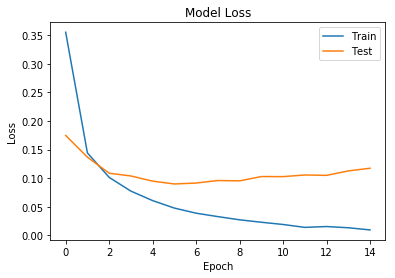
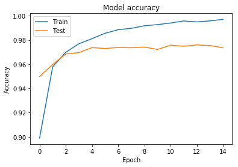
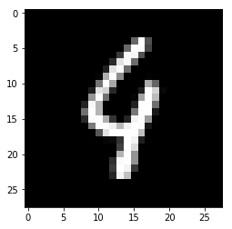

```python
from keras import layers, models
```

    D:\ProgramData\Anaconda3\envs\tensorflow-gpu\lib\site-packages\h5py\__init__.py:36: FutureWarning: Conversion of the second argument of issubdtype from `float` to `np.floating` is deprecated. In future, it will be treated as `np.float64 == np.dtype(float).type`.
      from ._conv import register_converters as _register_converters
    Using TensorFlow backend.
    


```python
import numpy as np
from keras import datasets
from keras.utils import np_utils
```


```python
XX = [1,2,3,4]
A, B, C, D = XX
print(A)
print(B)
print(C)
print(D)
```

    1
    2
    3
    4
    


```python
(x_train, y_train), (x_test, y_test) = datasets.mnist.load_data()
```

간단한 ANN을 위해 Mnist dataset을 load한다.
Mnist 는 손글씨들이 들어있는 데이터셋 이다.

Mnist 데이터셋은 train과 test셋으로 나뉘어 있으며, 
각 손글시(X)와 정답 레이블(Y)로 나뉘어있다.


```python
Y_train = np_utils.to_categorical(y_train)
```


```python
Y_test = np_utils.to_categorical(y_test)
```

to_catagorical을 하면, 1,2,3,4... 와 같이 숫자로 되어있던 데이터를 OneHot vector로 바꾸어준다.

아래에서, 실제 데이터를 통해 알아보자


```python
y_train
```


    array([5, 0, 4, ..., 5, 6, 8], dtype=uint8)


```python
Y_train
```


    array([[0., 0., 0., ..., 0., 0., 0.],
           [1., 0., 0., ..., 0., 0., 0.],
           [0., 0., 0., ..., 0., 0., 0.],
           ...,
           [0., 0., 0., ..., 0., 0., 0.],
           [0., 0., 0., ..., 0., 0., 0.],
           [0., 0., 0., ..., 0., 1., 0.]], dtype=float32)


5면 5번째(0부터 시작) 데이터가, 0이면 0번째 데이터가 1로 나머지는 0으로 찬 배열이 나오는것을 알 수 있다.

이런 형태의 배열을 OneHot vector 라 하며, classifier를 위해 자주 사용되는 형태이다.


```python
L, W, H = x_train.shape
```


```python
X_train = x_train.reshape(-1, W*H)
```


```python
X_test = x_test.reshape(-1, W*H)
```

학습을 위해, 이미지 파일 인, X의 형태를 바꿔주도록 한다.

한 줄로 표현된 데이터로 바꿔주며, 이를 직렬화 라고 부른다.


```python
X_test
```


    array([[0, 0, 0, ..., 0, 0, 0],
           [0, 0, 0, ..., 0, 0, 0],
           [0, 0, 0, ..., 0, 0, 0],
           ...,
           [0, 0, 0, ..., 0, 0, 0],
           [0, 0, 0, ..., 0, 0, 0],
           [0, 0, 0, ..., 0, 0, 0]], dtype=uint8)


```python
x_test
```


    array([[[0, 0, 0, ..., 0, 0, 0],
            [0, 0, 0, ..., 0, 0, 0],
            [0, 0, 0, ..., 0, 0, 0],
            ...,
            [0, 0, 0, ..., 0, 0, 0],
            [0, 0, 0, ..., 0, 0, 0],
            [0, 0, 0, ..., 0, 0, 0]],
    
           [[0, 0, 0, ..., 0, 0, 0],
            [0, 0, 0, ..., 0, 0, 0],
            [0, 0, 0, ..., 0, 0, 0],
            ...,
            [0, 0, 0, ..., 0, 0, 0],
            [0, 0, 0, ..., 0, 0, 0],
            [0, 0, 0, ..., 0, 0, 0]],
    
           [[0, 0, 0, ..., 0, 0, 0],
            [0, 0, 0, ..., 0, 0, 0],
            [0, 0, 0, ..., 0, 0, 0],
            ...,
            [0, 0, 0, ..., 0, 0, 0],
            [0, 0, 0, ..., 0, 0, 0],
            [0, 0, 0, ..., 0, 0, 0]],
    
           ...,
    
           [[0, 0, 0, ..., 0, 0, 0],
            [0, 0, 0, ..., 0, 0, 0],
            [0, 0, 0, ..., 0, 0, 0],
            ...,
            [0, 0, 0, ..., 0, 0, 0],
            [0, 0, 0, ..., 0, 0, 0],
            [0, 0, 0, ..., 0, 0, 0]],
    
           [[0, 0, 0, ..., 0, 0, 0],
            [0, 0, 0, ..., 0, 0, 0],
            [0, 0, 0, ..., 0, 0, 0],
            ...,
            [0, 0, 0, ..., 0, 0, 0],
            [0, 0, 0, ..., 0, 0, 0],
            [0, 0, 0, ..., 0, 0, 0]],
    
           [[0, 0, 0, ..., 0, 0, 0],
            [0, 0, 0, ..., 0, 0, 0],
            [0, 0, 0, ..., 0, 0, 0],
            ...,
            [0, 0, 0, ..., 0, 0, 0],
            [0, 0, 0, ..., 0, 0, 0],
            [0, 0, 0, ..., 0, 0, 0]]], dtype=uint8)


```python
X_train = X_train/255.0
X_test = X_test/255.0

```

최대 밝기는 255 이므로, 255로 나누어 가장 큰 수치가 1이 되도록 해준다.

이를 노멀라이징(정규화) 라 부른다.


```python
import matplotlib.pyplot as plt
```


```python
def plot_loss(history):
    plt.plot(history.history['loss'])
    plt.plot(history.history['val_loss'])
    plt.title('Model Loss')
    plt.ylabel('Loss')
    plt.xlabel('Epoch')
    plt.legend(['Train', 'Test'],loc=0)
    
```


```python
def plot_acc(history):
    plt.plot(history.history['acc'])
    plt.plot(history.history['val_acc'])
    plt.title('Model accuracy')
    plt.ylabel('Accuracy')
    plt.xlabel('Epoch')
    plt.legend(['Train', 'Test'],loc=0)
    
```

Loss와 Accuracy를 출력하는 함수를 작성한다


```python
Nin = 784
Nh = 100
number_of_class = 10
Nout = number_of_class
```

Input layer 는 784개(W*h), 히든 레이어의 노드는 100개, Out 노드의 갯수는 Class의 갯수이다.


```python
x = layers.Input(shape=(Nin,))
```

인풋레이어를 만듬


```python
h = layers.Activation('relu')(layers.Dense(Nh)(x))
h2 = layers.Activation('relu')(layers.Dense(Nh)(h))
```

히든레이어를 두개 만듬.


```python
y = layers.Activation('softmax')(layers.Dense(Nout)(h2))
```

softmax 함수로 Activate 함수를 사용하는 out노드를 만듬


```python
model = models.Model(x, y)
```

마지막으로, Input 노드와 Output노드로 Model을 정의

연결은 내부적으로 이어져 있음


```python
model.compile(loss='categorical_crossentropy', optimizer='adam', metrics=['accuracy'])
```

모델 컴파일


```python
history = model.fit(X_train, Y_train, epochs=15, batch_size=100, validation_split=0.2)
```

    Train on 48000 samples, validate on 12000 samples
    Epoch 1/15
    48000/48000 [==============================] - 8s 160us/step - loss: 0.3553 - acc: 0.8989 - val_loss: 0.1748 - val_acc: 0.9498
    Epoch 2/15
    48000/48000 [==============================] - 2s 40us/step - loss: 0.1443 - acc: 0.9579 - val_loss: 0.1369 - val_acc: 0.9598
    Epoch 3/15
    48000/48000 [==============================] - 2s 38us/step - loss: 0.1015 - acc: 0.9698 - val_loss: 0.1088 - val_acc: 0.9684
    Epoch 4/15
    48000/48000 [==============================] - 2s 38us/step - loss: 0.0775 - acc: 0.9769 - val_loss: 0.1040 - val_acc: 0.9696
    Epoch 5/15
    48000/48000 [==============================] - 2s 38us/step - loss: 0.0609 - acc: 0.9811 - val_loss: 0.0949 - val_acc: 0.9737
    Epoch 6/15
    48000/48000 [==============================] - 2s 38us/step - loss: 0.0478 - acc: 0.9855 - val_loss: 0.0900 - val_acc: 0.9730
    Epoch 7/15
    48000/48000 [==============================] - 2s 37us/step - loss: 0.0389 - acc: 0.9885 - val_loss: 0.0916 - val_acc: 0.9738
    Epoch 8/15
    48000/48000 [==============================] - 2s 38us/step - loss: 0.0329 - acc: 0.9896 - val_loss: 0.0960 - val_acc: 0.9736
    Epoch 9/15
    48000/48000 [==============================] - 2s 38us/step - loss: 0.0273 - acc: 0.9918 - val_loss: 0.0954 - val_acc: 0.9742
    Epoch 10/15
    48000/48000 [==============================] - 2s 39us/step - loss: 0.0231 - acc: 0.9927 - val_loss: 0.1029 - val_acc: 0.9722
    Epoch 11/15
    48000/48000 [==============================] - 2s 40us/step - loss: 0.0191 - acc: 0.9940 - val_loss: 0.1028 - val_acc: 0.9757
    Epoch 12/15
    48000/48000 [==============================] - 2s 38us/step - loss: 0.0141 - acc: 0.9957 - val_loss: 0.1057 - val_acc: 0.9748
    Epoch 13/15
    48000/48000 [==============================] - 2s 38us/step - loss: 0.0156 - acc: 0.9950 - val_loss: 0.1050 - val_acc: 0.9759
    Epoch 14/15
    48000/48000 [==============================] - 2s 42us/step - loss: 0.0134 - acc: 0.9958 - val_loss: 0.1128 - val_acc: 0.9754
    Epoch 15/15
    48000/48000 [==============================] - 2s 38us/step - loss: 0.0096 - acc: 0.9970 - val_loss: 0.1175 - val_acc: 0.9736
    

모델 피팅. 각 배치마다, 100개의 이미지 씩으로 하며, 0.2(20%)를validation 으로 사용한다.


```python
performance_test = model.evaluate(X_test, Y_test, batch_size=100)
```

    10000/10000 [==============================] - 0s 18us/step
    

아까 만들어 놓은 test set으로 평가


```python
performance_test
```


    [0.10288006307279829, 0.9766000062227249]


```python
plot_loss(history)
plt.show()
```





```python
plot_acc(history)
plt.show()
```





Train의 Accuracy는 점점 좋아지지만, Test는 일정 수치에서 유지된다.

이런 현상을 오버피팅 이라 부름

실제, 이미지들과, 어떤 숫자로 추론하는지 확인해보자.


```python
plt.gray()
plt.imshow(x_test[100])
c = model.predict(X_test[100:101])
c.tolist()[0].index(c.max())
```


    6


대체로 잘맞는것을 확인 가능함


```python
a = 115
plt.gray()
plt.imshow(x_test[a])
c = model.predict(X_test[a:a+1])
print("predict: ",c.tolist()[0].index(c.max()))

print("answer: ",y_test[a])
```

    predict:  9
    answer:  4
    





이런 특이한 경우에 답을 틀리고 있음.

틀리는 경우들을 확인해 보자


```python
A = []
P = []
ANS = []
for a in range(0, 10000):
    c = model.predict(X_test[a:a+1])
    pre = c.tolist()[0].index(c.max())
    ans = y_test[a]
    
    if(pre != ans):
        A.append(a)
        P.append(pre)
        ANS.append(ans)
        #print("index: ", a)
        #print("predict: ", pre)
        #print("answer: ", ans)
        


```


```python
w = 10
h = int(len(A)/10)
fig=plt.figure(figsize=(20, 20))

for j in range(0,230):
    fig.add_subplot(w,h,j+1)
    plt.title(str(P[j])+","+str(ANS[j]))
    plt.gray()
    plt.imshow(x_test[A[j]])
```


