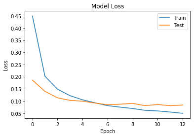
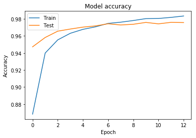
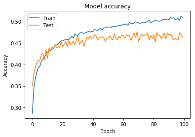
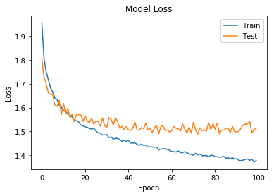
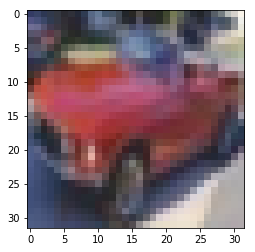
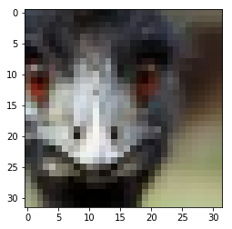
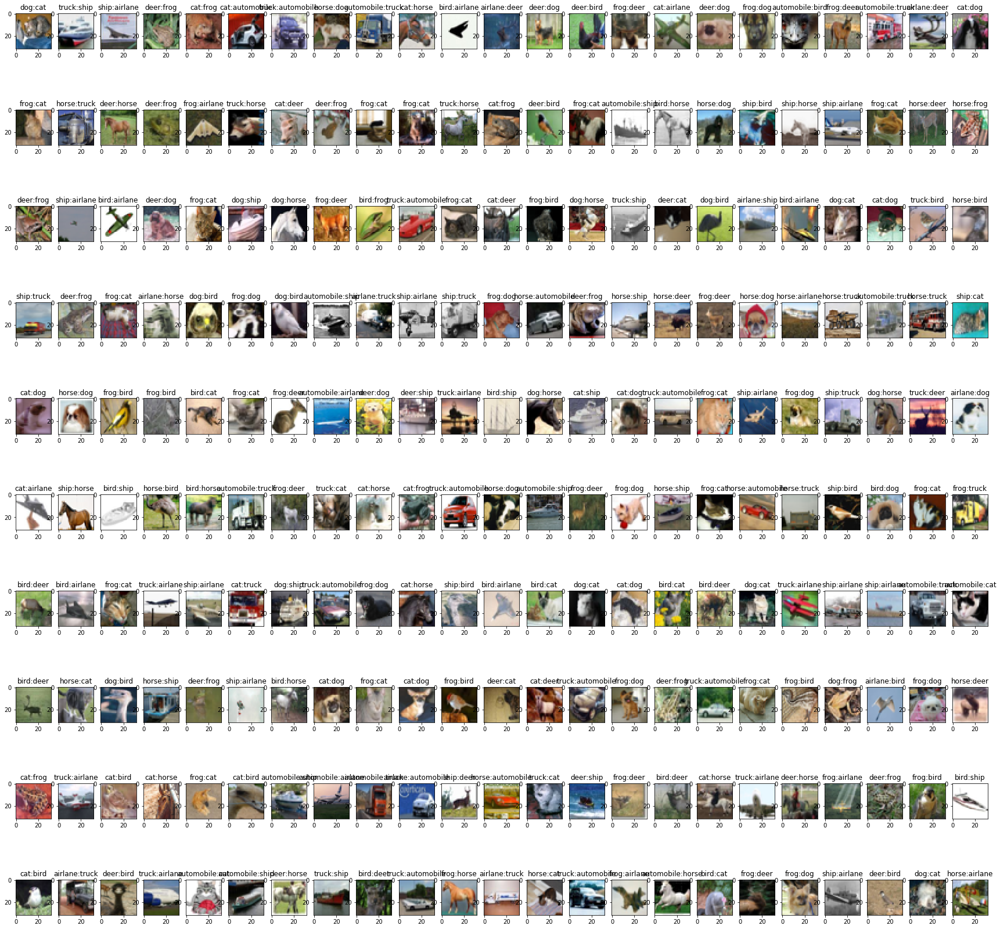

author: SongChiYoung

# DNN : DeepNeauralNetwork

----

## 준비과정


```python
import keras
from keras import layers, models
```

    D:\ProgramData\Anaconda3\envs\tensorflow-gpu\lib\site-packages\h5py\__init__.py:36: FutureWarning: Conversion of the second argument of issubdtype from `float` to `np.floating` is deprecated. In future, it will be treated as `np.float64 == np.dtype(float).type`.
      from ._conv import register_converters as _register_converters
    Using TensorFlow backend.
    


```python
import numpy as np
from keras import datasets
from keras.utils import np_utils
from kerasapp.skeras import plot_loss, plot_acc
```


```python
(x_train, y_train), (x_test, y_test) = datasets.mnist.load_data()
```


```python
Y_train = np_utils.to_categorical(y_train)
```


```python
Y_test = np_utils.to_categorical(y_test)
```


```python
L,W,H = x_train.shape
```


```python
X_train = x_train.reshape(-1, W*H)
X_test = x_test.reshape(-1, W*H)
```


```python
X_train = X_train / 255.0
X_test = X_test / 255.0
```

이번엔 조금 더 깊은 학습을 해봅시다.

준비과정은 ANN과 동일합니다.

## 신경망


```python
Nin = 784
Nh_l = [100, 50]
number_of_class = 10
Nout = number_of_class
```

깊은 학습을 위한 신경 디자인 입니다.

ANN과 달리 히든레이어를 여러개 사용합니다.(저의 경우엔 ANN에서도 히든레이어를 2개 사용했었습니다. 2개면 어떻게 되나 궁금했엇는데... 뒤에서 나오네요.ㅋㅋ)


```python
input_layer = layers.Input(shape=(Nin,), name="input")
relu = layers.Activation('relu')
h1 = layers.Dropout(0.2)(relu(layers.Dense(Nh_l[0])(input_layer)))
h2 = relu(layers.Dense(Nh_l[1])(h1))
out = layers.Activation('softmax')(layers.Dense(Nout)(h2))
model = models.Model(input_layer, out)
```

중간에 있는 Dropout은 DNN에서 말한 "오버피팅"을 방지하기 위한 방법론 입니다.

학습할 때, 랜덤하게 일정수치(여기서는 0.2)의 노드를 제거하고 학습합니다.

일정 노드를 랜덤하게 없이 학습과 평가를 위해서는 원래는 복잡한 식이 필요하지만, Keras에선 자동으로 해줍니다.


```python
model.compile(loss='categorical_crossentropy', optimizer='adam', metrics=['accuracy'])
```

모델 컴파일을 조금 더 자세히 봅시다.

### loss
loss는 답과 예측값 사이 오차를 계산하는 모델을 지정합니다. 이 경우엔, **Categorical_crossentropy**를 사용했습니다.

\(y\) : 실제값 (0 or 1)   /   \( \hat{y} \) : 예측값 (확률) 일 때, \( -\Sigma{y log \hat{y}} \) 입니다.


낮은 확률로 예측하였지만 맞추거나, 높은 확률로 예측하였지만 틀리는 경우 loss가 더 큽니다.


범주형 변수를 예측할 때 사용합니다.


### optimizer
optimizer는 오차를 0에 가깝게 진행하기 위한 함수입니다. 다양한 optimizer가 있으며, 대부분 경사하강법에 기반합니다.

경사하강법이란, weight를 바꾸었을 때, 변하는 loss값의 경사를 연산하여, 경사도에 비례하는 만큼씩 weight를 바꾸어주는 방법입니다.

이를 통해, 경사도가 클 때(아마도, loss값이 크며, loss값이 최소화 되는 지점이 먼 경우)에는 많은 수치의 weight변화를 통해 학습의 속도를 빠르게 해주고,

경사도가 작을 때(아마도, loss값이 작으며, 최소화 되는 지점이 가까울 경우)에는 작은 수치의weight변화를 주어서, 최저점을 지나쳐 버려서 학습 효율을 낮추는 일을 줄여줍니다.


```python
history = model.fit(X_train, Y_train, epochs=13, batch_size=100, validation_split=0.2)
```

    Train on 48000 samples, validate on 12000 samples
    Epoch 1/13
    48000/48000 [==============================] - 3s 64us/step - loss: 0.4499 - acc: 0.8683 - val_loss: 0.1860 - val_acc: 0.9473
    Epoch 2/13
    48000/48000 [==============================] - 2s 37us/step - loss: 0.2016 - acc: 0.9399 - val_loss: 0.1397 - val_acc: 0.9582
    Epoch 3/13
    48000/48000 [==============================] - 2s 37us/step - loss: 0.1489 - acc: 0.9554 - val_loss: 0.1133 - val_acc: 0.9656
    Epoch 4/13
    48000/48000 [==============================] - 2s 39us/step - loss: 0.1220 - acc: 0.9631 - val_loss: 0.1028 - val_acc: 0.9681
    Epoch 5/13
    48000/48000 [==============================] - 2s 37us/step - loss: 0.1051 - acc: 0.9677 - val_loss: 0.0993 - val_acc: 0.9703
    Epoch 6/13
    48000/48000 [==============================] - 2s 37us/step - loss: 0.0927 - acc: 0.9707 - val_loss: 0.0917 - val_acc: 0.9718
    Epoch 7/13
    48000/48000 [==============================] - 2s 40us/step - loss: 0.0811 - acc: 0.9747 - val_loss: 0.0849 - val_acc: 0.9743
    Epoch 8/13
    48000/48000 [==============================] - 2s 43us/step - loss: 0.0750 - acc: 0.9761 - val_loss: 0.0870 - val_acc: 0.9728
    Epoch 9/13
    48000/48000 [==============================] - 2s 42us/step - loss: 0.0692 - acc: 0.9780 - val_loss: 0.0903 - val_acc: 0.9737
    Epoch 10/13
    48000/48000 [==============================] - 2s 46us/step - loss: 0.0617 - acc: 0.9803 - val_loss: 0.0810 - val_acc: 0.9758
    Epoch 11/13
    48000/48000 [==============================] - 2s 41us/step - loss: 0.0593 - acc: 0.9805 - val_loss: 0.0857 - val_acc: 0.9742
    Epoch 12/13
    48000/48000 [==============================] - 2s 39us/step - loss: 0.0547 - acc: 0.9817 - val_loss: 0.0807 - val_acc: 0.9759
    Epoch 13/13
    48000/48000 [==============================] - 2s 46us/step - loss: 0.0495 - acc: 0.9834 - val_loss: 0.0837 - val_acc: 0.9757
    


```python
performance_test = model.evaluate(X_test, Y_test, batch_size=100)
```

    10000/10000 [==============================] - 0s 21us/step
    


```python
plot_loss(history)
```





```python
plot_acc(history)
```





각, 이전 simple_ann 에서의 결과와 비교해보면, 오버피팅이 사라진것을 확인 가능합니다.

하지만, accuracy는 떨어질수도 있다. Dropout을 사용할 경우, hidden레이어 에서 해당 갯수만큼의 노드가 적은것과 동일하기 때문입니다.

----


### CIFAR-10의 경우

CIFAR-10은 Mnist와 달리 컬러로 된, 사물 데이터셋 입니다.

작성한 모델이 조금 더 복잡한 환경인 CIFAR-10에서도 잘 작동하는지 알아봅시다.


```python
def data_func():
    (x_train, y_train), (x_test, y_test) = datasets.cifar10.load_data()
    
    Y_test = np_utils.to_categorical(y_test)
    Y_train = np_utils.to_categorical(y_train)
    
    L,W,H,C = x_train.shape
    
    X_test = x_test.reshape(-1, W*H*C)
    X_train = x_train.reshape(-1, W*H*C)
    
    X_test = X_test/255.0
    X_train = X_train/255.0
    
    return (X_train, Y_train), (X_test, Y_test), (x_train, x_test, y_test)
```


```python
(xtrain, ytrain), (xtest, ytest), (train_img, test_img, y_test) = data_func()
```

준비과정은 Mnist와 동일합니다. 하지만, reshape를 통해 직렬화를 할 때, Color 때문에 W\*H가 아닌, W\*H\*C를 하는점을 조심해야 합니다.


```python
Nin = xtrain.shape[1]
Nh_l = [100, 50]
Pd_l = [0.05, 0.05]
number_of_class = 10
Nout = number_of_class
```


```python
relu = layers.Activation('relu')
softmax = layers.Activation('softmax')
dr1 = layers.Dropout(Pd_l[0])
dr2 = layers.Dropout(Pd_l[1])
inL = layers.Input(shape=(Nin, ))
h1L = dr1(relu(layers.Dense(Nh_l[0])(inL)))
h2L = dr2(relu(layers.Dense(Nh_l[1])(h1L)))
out = softmax(layers.Dense(Nout)(h2L))
```


```python
model = models.Model(inL, out)
```


```python
model.compile(loss='categorical_crossentropy', optimizer='adam', metrics=['accuracy'])
```

모델을 만드는 과정 또한 동일합니다.


```python
history = model.fit(xtrain, ytrain, batch_size=100, epochs=100, validation_split=0.2)
```

    Train on 40000 samples, validate on 10000 samples
    Epoch 1/100
    40000/40000 [==============================] - 3s 75us/step - loss: 1.9569 - acc: 0.2866 - val_loss: 1.8067 - val_acc: 0.3502
    Epoch 2/100
    40000/40000 [==============================] - 3s 66us/step - loss: 1.8070 - acc: 0.3457 - val_loss: 1.7278 - val_acc: 0.3784
    Epoch 3/100
    40000/40000 [==============================] - 3s 68us/step - loss: 1.7516 - acc: 0.3686 - val_loss: 1.7004 - val_acc: 0.3935
    Epoch 4/100
    40000/40000 [==============================] - 3s 67us/step - loss: 1.7168 - acc: 0.3828 - val_loss: 1.6625 - val_acc: 0.4058
    Epoch 5/100
    40000/40000 [==============================] - 3s 70us/step - loss: 1.6837 - acc: 0.3940 - val_loss: 1.6555 - val_acc: 0.4095
    Epoch 6/100
    40000/40000 [==============================] - 3s 69us/step - loss: 1.6664 - acc: 0.3968 - val_loss: 1.6540 - val_acc: 0.4102
    Epoch 7/100
    40000/40000 [==============================] - 3s 69us/step - loss: 1.6398 - acc: 0.4081 - val_loss: 1.6116 - val_acc: 0.4230
    Epoch 8/100
    40000/40000 [==============================] - 3s 65us/step - loss: 1.6350 - acc: 0.4114 - val_loss: 1.6049 - val_acc: 0.4256
    Epoch 9/100
    40000/40000 [==============================] - 3s 69us/step - loss: 1.6113 - acc: 0.4169 - val_loss: 1.6301 - val_acc: 0.4110
    Epoch 10/100
    40000/40000 [==============================] - 3s 66us/step - loss: 1.6014 - acc: 0.4220 - val_loss: 1.5704 - val_acc: 0.4345
    Epoch 11/100
    40000/40000 [==============================] - 3s 68us/step - loss: 1.5886 - acc: 0.4280 - val_loss: 1.6179 - val_acc: 0.4144
    Epoch 12/100
    40000/40000 [==============================] - 3s 67us/step - loss: 1.5821 - acc: 0.4325 - val_loss: 1.5735 - val_acc: 0.4380
    Epoch 13/100
    40000/40000 [==============================] - 3s 67us/step - loss: 1.5751 - acc: 0.4330 - val_loss: 1.5953 - val_acc: 0.4308
    Epoch 14/100
    40000/40000 [==============================] - 3s 67us/step - loss: 1.5683 - acc: 0.4354 - val_loss: 1.5569 - val_acc: 0.4407
    Epoch 15/100
    40000/40000 [==============================] - 3s 67us/step - loss: 1.5604 - acc: 0.4373 - val_loss: 1.5721 - val_acc: 0.4364
    Epoch 16/100
    40000/40000 [==============================] - 3s 68us/step - loss: 1.5468 - acc: 0.4437 - val_loss: 1.5405 - val_acc: 0.4468
    Epoch 17/100
    40000/40000 [==============================] - 3s 68us/step - loss: 1.5446 - acc: 0.4455 - val_loss: 1.5708 - val_acc: 0.4385
    Epoch 18/100
    40000/40000 [==============================] - 3s 65us/step - loss: 1.5405 - acc: 0.4468 - val_loss: 1.5701 - val_acc: 0.4417
    Epoch 19/100
    40000/40000 [==============================] - 3s 66us/step - loss: 1.5262 - acc: 0.4522 - val_loss: 1.5721 - val_acc: 0.4389
    Epoch 20/100
    40000/40000 [==============================] - 3s 66us/step - loss: 1.5228 - acc: 0.4550 - val_loss: 1.5420 - val_acc: 0.4525
    Epoch 21/100
    40000/40000 [==============================] - 3s 68us/step - loss: 1.5187 - acc: 0.4548 - val_loss: 1.5655 - val_acc: 0.4418
    Epoch 22/100
    40000/40000 [==============================] - 3s 67us/step - loss: 1.5165 - acc: 0.4571 - val_loss: 1.5409 - val_acc: 0.4474
    Epoch 23/100
    40000/40000 [==============================] - 3s 69us/step - loss: 1.5119 - acc: 0.4573 - val_loss: 1.5373 - val_acc: 0.4540
    Epoch 24/100
    40000/40000 [==============================] - 3s 69us/step - loss: 1.5096 - acc: 0.4581 - val_loss: 1.5552 - val_acc: 0.4415
    Epoch 25/100
    40000/40000 [==============================] - 3s 69us/step - loss: 1.5138 - acc: 0.4579 - val_loss: 1.5297 - val_acc: 0.4560
    Epoch 26/100
    40000/40000 [==============================] - 3s 69us/step - loss: 1.5011 - acc: 0.4609 - val_loss: 1.5425 - val_acc: 0.4456
    Epoch 27/100
    40000/40000 [==============================] - 3s 67us/step - loss: 1.4935 - acc: 0.4655 - val_loss: 1.5409 - val_acc: 0.4492
    Epoch 28/100
    40000/40000 [==============================] - 3s 66us/step - loss: 1.4925 - acc: 0.4621 - val_loss: 1.5217 - val_acc: 0.4545
    Epoch 29/100
    40000/40000 [==============================] - 3s 69us/step - loss: 1.4848 - acc: 0.4709 - val_loss: 1.5561 - val_acc: 0.4460
    Epoch 30/100
    40000/40000 [==============================] - 3s 67us/step - loss: 1.4851 - acc: 0.4681 - val_loss: 1.5242 - val_acc: 0.4574
    Epoch 31/100
    40000/40000 [==============================] - 3s 68us/step - loss: 1.4866 - acc: 0.4667 - val_loss: 1.5174 - val_acc: 0.4673
    Epoch 32/100
    40000/40000 [==============================] - 3s 68us/step - loss: 1.4738 - acc: 0.4723 - val_loss: 1.5569 - val_acc: 0.4465
    Epoch 33/100
    40000/40000 [==============================] - 3s 66us/step - loss: 1.4767 - acc: 0.4745 - val_loss: 1.5505 - val_acc: 0.4531
    Epoch 34/100
    40000/40000 [==============================] - 3s 67us/step - loss: 1.4673 - acc: 0.4732 - val_loss: 1.5260 - val_acc: 0.4563
    Epoch 35/100
    40000/40000 [==============================] - 3s 70us/step - loss: 1.4714 - acc: 0.4726 - val_loss: 1.5574 - val_acc: 0.4419
    Epoch 36/100
    40000/40000 [==============================] - 3s 67us/step - loss: 1.4705 - acc: 0.4737 - val_loss: 1.5405 - val_acc: 0.4536
    Epoch 37/100
    40000/40000 [==============================] - 3s 67us/step - loss: 1.4653 - acc: 0.4751 - val_loss: 1.5124 - val_acc: 0.4631
    Epoch 38/100
    40000/40000 [==============================] - 3s 67us/step - loss: 1.4587 - acc: 0.4775 - val_loss: 1.5211 - val_acc: 0.4599
    Epoch 39/100
    40000/40000 [==============================] - 3s 69us/step - loss: 1.4619 - acc: 0.4753 - val_loss: 1.5075 - val_acc: 0.4661
    Epoch 40/100
    40000/40000 [==============================] - 3s 72us/step - loss: 1.4569 - acc: 0.4768 - val_loss: 1.5203 - val_acc: 0.4604
    Epoch 41/100
    40000/40000 [==============================] - 3s 73us/step - loss: 1.4629 - acc: 0.4769 - val_loss: 1.5061 - val_acc: 0.4628
    Epoch 42/100
    40000/40000 [==============================] - 3s 71us/step - loss: 1.4513 - acc: 0.4812 - val_loss: 1.5040 - val_acc: 0.4694
    Epoch 43/100
    40000/40000 [==============================] - 3s 67us/step - loss: 1.4506 - acc: 0.4802 - val_loss: 1.5134 - val_acc: 0.4659
    Epoch 44/100
    40000/40000 [==============================] - 3s 66us/step - loss: 1.4514 - acc: 0.4784 - val_loss: 1.5393 - val_acc: 0.4566
    Epoch 45/100
    40000/40000 [==============================] - 3s 66us/step - loss: 1.4457 - acc: 0.4822 - val_loss: 1.5057 - val_acc: 0.4629
    Epoch 46/100
    40000/40000 [==============================] - 3s 68us/step - loss: 1.4405 - acc: 0.4838 - val_loss: 1.5054 - val_acc: 0.4639
    Epoch 47/100
    40000/40000 [==============================] - 3s 71us/step - loss: 1.4463 - acc: 0.4804 - val_loss: 1.5158 - val_acc: 0.4641
    Epoch 48/100
    40000/40000 [==============================] - 3s 67us/step - loss: 1.4408 - acc: 0.4851 - val_loss: 1.5117 - val_acc: 0.4624
    Epoch 49/100
    40000/40000 [==============================] - 3s 68us/step - loss: 1.4428 - acc: 0.4853 - val_loss: 1.5351 - val_acc: 0.4541
    Epoch 50/100
    40000/40000 [==============================] - 3s 66us/step - loss: 1.4343 - acc: 0.4871 - val_loss: 1.5058 - val_acc: 0.4608
    Epoch 51/100
    40000/40000 [==============================] - 3s 67us/step - loss: 1.4349 - acc: 0.4872 - val_loss: 1.5114 - val_acc: 0.4614
    Epoch 52/100
    40000/40000 [==============================] - 3s 68us/step - loss: 1.4346 - acc: 0.4871 - val_loss: 1.4952 - val_acc: 0.4667
    Epoch 53/100
    40000/40000 [==============================] - 3s 69us/step - loss: 1.4337 - acc: 0.4865 - val_loss: 1.5165 - val_acc: 0.4613
    Epoch 54/100
    40000/40000 [==============================] - 3s 67us/step - loss: 1.4341 - acc: 0.4880 - val_loss: 1.5241 - val_acc: 0.4567
    Epoch 55/100
    40000/40000 [==============================] - 3s 68us/step - loss: 1.4217 - acc: 0.4892 - val_loss: 1.4899 - val_acc: 0.4709
    Epoch 56/100
    40000/40000 [==============================] - 3s 68us/step - loss: 1.4253 - acc: 0.4874 - val_loss: 1.5219 - val_acc: 0.4608
    Epoch 57/100
    40000/40000 [==============================] - 3s 71us/step - loss: 1.4268 - acc: 0.4899 - val_loss: 1.5230 - val_acc: 0.4575
    Epoch 58/100
    40000/40000 [==============================] - 3s 69us/step - loss: 1.4270 - acc: 0.4904 - val_loss: 1.5035 - val_acc: 0.4653
    Epoch 59/100
    40000/40000 [==============================] - 3s 68us/step - loss: 1.4234 - acc: 0.4910 - val_loss: 1.5056 - val_acc: 0.4607
    Epoch 60/100
    40000/40000 [==============================] - 3s 67us/step - loss: 1.4210 - acc: 0.4915 - val_loss: 1.4967 - val_acc: 0.4690
    Epoch 61/100
    40000/40000 [==============================] - 3s 67us/step - loss: 1.4154 - acc: 0.4939 - val_loss: 1.5029 - val_acc: 0.4669
    Epoch 62/100
    40000/40000 [==============================] - 3s 66us/step - loss: 1.4145 - acc: 0.4933 - val_loss: 1.5200 - val_acc: 0.4608
    Epoch 63/100
    40000/40000 [==============================] - 3s 67us/step - loss: 1.4131 - acc: 0.4945 - val_loss: 1.5127 - val_acc: 0.4696
    Epoch 64/100
    40000/40000 [==============================] - 3s 71us/step - loss: 1.4185 - acc: 0.4909 - val_loss: 1.5104 - val_acc: 0.4662
    Epoch 65/100
    40000/40000 [==============================] - 3s 67us/step - loss: 1.4103 - acc: 0.4981 - val_loss: 1.5006 - val_acc: 0.4673
    Epoch 66/100
    40000/40000 [==============================] - 3s 69us/step - loss: 1.4105 - acc: 0.4955 - val_loss: 1.5310 - val_acc: 0.4561
    Epoch 67/100
    40000/40000 [==============================] - 3s 69us/step - loss: 1.4149 - acc: 0.4952 - val_loss: 1.5092 - val_acc: 0.4643
    Epoch 68/100
    40000/40000 [==============================] - 3s 69us/step - loss: 1.4098 - acc: 0.4960 - val_loss: 1.4945 - val_acc: 0.4737
    Epoch 69/100
    40000/40000 [==============================] - 3s 71us/step - loss: 1.4055 - acc: 0.4993 - val_loss: 1.5174 - val_acc: 0.4634
    Epoch 70/100
    40000/40000 [==============================] - 3s 70us/step - loss: 1.4025 - acc: 0.4982 - val_loss: 1.4925 - val_acc: 0.4763
    Epoch 71/100
    40000/40000 [==============================] - 3s 69us/step - loss: 1.3996 - acc: 0.4974 - val_loss: 1.5388 - val_acc: 0.4535
    Epoch 72/100
    40000/40000 [==============================] - 3s 68us/step - loss: 1.4079 - acc: 0.4952 - val_loss: 1.5062 - val_acc: 0.4635
    Epoch 73/100
    40000/40000 [==============================] - 3s 69us/step - loss: 1.4014 - acc: 0.4972 - val_loss: 1.4883 - val_acc: 0.4706
    Epoch 74/100
    40000/40000 [==============================] - 3s 70us/step - loss: 1.4044 - acc: 0.4973 - val_loss: 1.5154 - val_acc: 0.4663
    Epoch 75/100
    40000/40000 [==============================] - 3s 70us/step - loss: 1.3977 - acc: 0.4970 - val_loss: 1.5024 - val_acc: 0.4688
    Epoch 76/100
    40000/40000 [==============================] - 3s 72us/step - loss: 1.3975 - acc: 0.4982 - val_loss: 1.5073 - val_acc: 0.4688
    Epoch 77/100
    40000/40000 [==============================] - 3s 68us/step - loss: 1.3991 - acc: 0.5003 - val_loss: 1.5009 - val_acc: 0.4729
    Epoch 78/100
    40000/40000 [==============================] - 3s 69us/step - loss: 1.3930 - acc: 0.5024 - val_loss: 1.5364 - val_acc: 0.4571
    Epoch 79/100
    40000/40000 [==============================] - 3s 67us/step - loss: 1.3996 - acc: 0.4978 - val_loss: 1.5063 - val_acc: 0.4676
    Epoch 80/100
    40000/40000 [==============================] - 3s 67us/step - loss: 1.3989 - acc: 0.4996 - val_loss: 1.5309 - val_acc: 0.4607
    Epoch 81/100
    40000/40000 [==============================] - 3s 68us/step - loss: 1.3932 - acc: 0.4987 - val_loss: 1.5090 - val_acc: 0.4694
    Epoch 82/100
    40000/40000 [==============================] - 3s 72us/step - loss: 1.3934 - acc: 0.5037 - val_loss: 1.5350 - val_acc: 0.4526
    Epoch 83/100
    40000/40000 [==============================] - 3s 68us/step - loss: 1.3913 - acc: 0.5014 - val_loss: 1.4890 - val_acc: 0.4741
    Epoch 84/100
    40000/40000 [==============================] - 3s 67us/step - loss: 1.3924 - acc: 0.5013 - val_loss: 1.5055 - val_acc: 0.4670
    Epoch 85/100
    40000/40000 [==============================] - 3s 68us/step - loss: 1.3950 - acc: 0.5005 - val_loss: 1.5062 - val_acc: 0.4679
    Epoch 86/100
    40000/40000 [==============================] - 3s 70us/step - loss: 1.3868 - acc: 0.5027 - val_loss: 1.5121 - val_acc: 0.4601
    Epoch 87/100
    40000/40000 [==============================] - 3s 68us/step - loss: 1.3893 - acc: 0.5049 - val_loss: 1.5144 - val_acc: 0.4663
    Epoch 88/100
    40000/40000 [==============================] - 3s 71us/step - loss: 1.3843 - acc: 0.5053 - val_loss: 1.4946 - val_acc: 0.4730
    Epoch 89/100
    40000/40000 [==============================] - 3s 70us/step - loss: 1.3897 - acc: 0.5045 - val_loss: 1.5206 - val_acc: 0.4595
    Epoch 90/100
    40000/40000 [==============================] - 3s 71us/step - loss: 1.3831 - acc: 0.5060 - val_loss: 1.4991 - val_acc: 0.4732
    Epoch 91/100
    40000/40000 [==============================] - 3s 74us/step - loss: 1.3855 - acc: 0.5037 - val_loss: 1.4980 - val_acc: 0.4692
    Epoch 92/100
    40000/40000 [==============================] - 3s 69us/step - loss: 1.3780 - acc: 0.5103 - val_loss: 1.5006 - val_acc: 0.4703
    Epoch 93/100
    40000/40000 [==============================] - 3s 70us/step - loss: 1.3770 - acc: 0.5073 - val_loss: 1.5142 - val_acc: 0.4653
    Epoch 94/100
    40000/40000 [==============================] - 3s 67us/step - loss: 1.3791 - acc: 0.5085 - val_loss: 1.5275 - val_acc: 0.4576
    Epoch 95/100
    40000/40000 [==============================] - 3s 67us/step - loss: 1.3827 - acc: 0.5050 - val_loss: 1.5300 - val_acc: 0.4603
    Epoch 96/100
    40000/40000 [==============================] - 3s 66us/step - loss: 1.3837 - acc: 0.5053 - val_loss: 1.5323 - val_acc: 0.4589
    Epoch 97/100
    40000/40000 [==============================] - 3s 68us/step - loss: 1.3781 - acc: 0.5073 - val_loss: 1.5420 - val_acc: 0.4565
    Epoch 98/100
    40000/40000 [==============================] - 3s 69us/step - loss: 1.3827 - acc: 0.5026 - val_loss: 1.4939 - val_acc: 0.4739
    Epoch 99/100
    40000/40000 [==============================] - 3s 71us/step - loss: 1.3707 - acc: 0.5130 - val_loss: 1.5076 - val_acc: 0.4693
    Epoch 100/100
    40000/40000 [==============================] - 3s 67us/step - loss: 1.3773 - acc: 0.5098 - val_loss: 1.5128 - val_acc: 0.4634
    


```python
model.evaluate(xtest, ytest, batch_size=100)
```

    10000/10000 [==============================] - 0s 35us/step
    


    [1.5006141018867494, 0.4617999964952469]


```python
plot_acc(history)
```





```python
plot_loss(history)
```





Color 데이터셋의 경우 accuracy가 낮길래, 100번 epoch를 돌려보았습니다. 

어느 경우 맞추고, 못맞추는지 확인해 봅시다.


```python
y_test
```


    array([[3],
           [8],
           [8],
           ...,
           [5],
           [1],
           [7]])


```python
label= ["airlane",'automobile','bird','cat','deer','dog','frog','horse','ship','truck']
```


```python
import matplotlib.pyplot as plt
a = 351
plt.imshow(test_img[a])
c = model.predict(xtest[a:a+1])
print("predict: ",label[c.tolist()[0].index(c.max())])

print("answer: ",label[y_test[a][0]])
```

    predict:  automobile
    answer:  automobile
    





정답을 맞추고 있습니다.


```python
a = 35
plt.imshow(test_img[a])
c = model.predict(xtest[a:a+1])
print("predict: ",label[c.tolist()[0].index(c.max())])

print("answer: ",label[y_test[a][0]])
```

    predict:  automobile
    answer:  bird
    





cifar-10의 경우 Mnist와 달리, 명확해 보이는 경우에도 못맞추는 경우가 많습니다.

실제, 위의 Accuracy그래프 에서도 50%정도의 적중율만 보여줍니다.


```python
A = []
P = []
ANS = []
for a in range(0, 10000):
    c = model.predict(xtest[a:a+1])
    pre = c.tolist()[0].index(c.max())
    ans = y_test[a]
    
    if(pre != ans):
        A.append(a)
        P.append(pre)
        ANS.append(ans)
        #print("index: ", a)
        #print("predict: ", pre)
        #print("answer: ", ans)
        


```


```python
w = 10
h = 23
fig=plt.figure(figsize=(30, 30))

for j in range(0,230):
    fig.add_subplot(w,h,j+1)
    plt.title(label[P[j]]+":"+label[ANS[j][0]])
    plt.imshow(test_img[A[j]])
```




