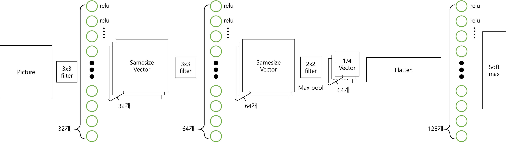
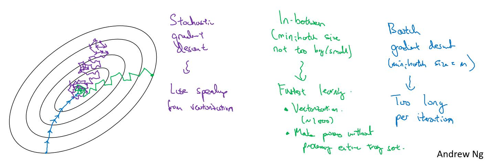
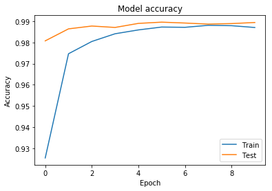
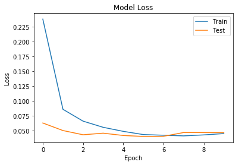
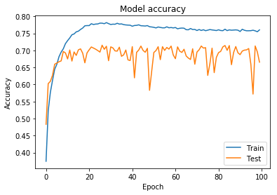
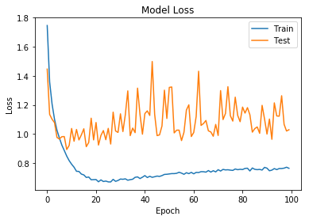
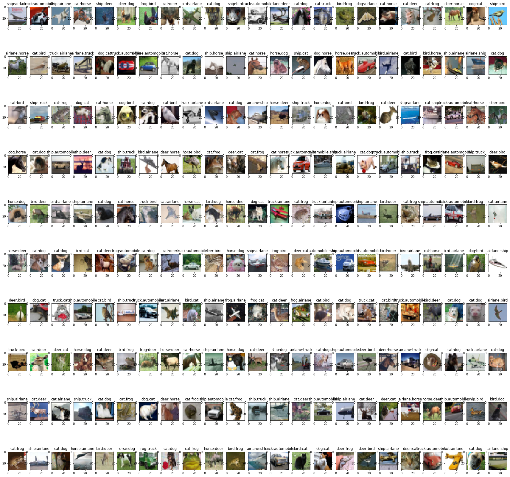

# CNN : Convolution Neural Nerwork


```python
import keras
from keras import models, layers
from keras import backend
```

    D:\ProgramData\Anaconda3\envs\tensorflow-gpu\lib\site-packages\h5py\__init__.py:36: FutureWarning: Conversion of the second argument of issubdtype from `float` to `np.floating` is deprecated. In future, it will be treated as `np.float64 == np.dtype(float).type`.
      from ._conv import register_converters as _register_converters
    Using TensorFlow backend.
    

## 필기체 인식


```python
class cnn(models.Model):
    def __init__(self, input_shape, num_class):
        relu = layers.Activation('relu')

        inL = layers.Input(shape=input_shape)

        conv0 = relu(layers.Conv2D(32, kernel_size=(3,3))(inL))
        conv1 = layers.Conv2D(64, (3,3), activation='relu')(conv0)
        maxpool = layers.MaxPooling2D(pool_size=(2,2))(conv1)
        drop_and_flat = layers.Flatten()(layers.Dropout(0.25)(maxpool))
        fc0 = relu(layers.Dense(128)(drop_and_flat))
        drop = layers.Dropout(0.5)(fc0)
        out = layers.Activation('softmax')(layers.Dense(num_class)(drop))     
        
        super().__init__(inL, out)
        self.compile(loss=keras.losses.categorical_crossentropy, optimizer='rmsprop', metrics=['accuracy'])
```

CNN의 경우 keras에서 바로 제공하는 CNN Layer가 존재하지는 않는다.

하지만, Convolutional layer와 paxpool 그리고 flatten 등 필요한 layer들은 미리 만들어져서 제공된다.

우리가(내가 (사실 참고한 책이) ) 설계한 모델은 아래와 같다

이는 LeNet 모델을 약간 변형한 것 이다.(두번째 Conv 레이어가 32개에서 64개)



```python
from keras import datasets
class DATA():
    def __init__(self):
        num_classes = 10
        (x_train, y_train), (x_test, y_test) = datasets.mnist.load_data()
        
        self.X_test = x_test
        self.Y_test = y_test
        
        img_rows, img_cols = x_train.shape[1:]
        
        if backend.image_data_format() == 'channels_first':
            X_train = x_train.reshape(x_train.shape[0], 1, img_rows, img_cols)
            X_test = x_test.reshape(x_test.shape[0], 1, img_rows, img_cols)
            input_shape = (1, img_rows, img_cols)
        else:
            X_train = x_train.reshape(x_train.shape[0], img_rows, img_cols, 1)
            X_test = x_test.reshape(x_test.shape[0], img_rows, img_cols, 1)
            input_shape = (img_rows, img_cols, 1)
        

        
        X_train = X_train.astype('float32')
        X_test = X_test.astype('float32')
        
        X_train /= 255.0
        X_test /= 255.0
            
        Y_train = keras.utils.np_utils.to_categorical(y_train, num_classes)
        Y_test = keras.utils.np_utils.to_categorical(y_test, num_classes)
        
        self.input_shape = input_shape
        self.num_classes = num_classes
        self.x_train, self.y_train = X_train, Y_train
        self.x_test, self.y_test = X_test, Y_test
```

데이터를 가져오고, 선처리하는 과정은 여태까지와 같다.


```python
from kerasapp.skeras import plot_acc, plot_loss
```


```python
import matplotlib.pyplot as plt
```


```python
batch_size = 128
epochs = 10

data = DATA()
```


```python

model = cnn(data.input_shape, data.num_classes)
```

위의 CNN 클래스 에서, 다음과 같이 정의하였다.

```
self.compile(loss=keras.losses.categorical_crossentropy, optimizer='rmsprop', metrics=['accuracy'])
```

따라서, optimizer로는 rmsprop를 loss로는 crossentropy를 사용하는것을 알 수 있다.

### 수행 결과


```python
history = model.fit(data.x_train, data.y_train, batch_size=batch_size, epochs=epochs, validation_split=0.2)
```

    Train on 48000 samples, validate on 12000 samples
    Epoch 1/10
    48000/48000 [==============================] - 11s 222us/step - loss: 0.2380 - acc: 0.9255 - val_loss: 0.0625 - val_acc: 0.9807
    Epoch 2/10
    48000/48000 [==============================] - 7s 140us/step - loss: 0.0857 - acc: 0.9747 - val_loss: 0.0498 - val_acc: 0.9864
    Epoch 3/10
    48000/48000 [==============================] - 7s 137us/step - loss: 0.0657 - acc: 0.9805 - val_loss: 0.0427 - val_acc: 0.9877
    Epoch 4/10
    48000/48000 [==============================] - 7s 138us/step - loss: 0.0553 - acc: 0.9841 - val_loss: 0.0454 - val_acc: 0.9871
    Epoch 5/10
    48000/48000 [==============================] - 7s 137us/step - loss: 0.0485 - acc: 0.9859 - val_loss: 0.0415 - val_acc: 0.9890
    Epoch 6/10
    48000/48000 [==============================] - 7s 137us/step - loss: 0.0430 - acc: 0.9873 - val_loss: 0.0398 - val_acc: 0.9896
    Epoch 7/10
    48000/48000 [==============================] - 7s 137us/step - loss: 0.0419 - acc: 0.9871 - val_loss: 0.0401 - val_acc: 0.9892
    Epoch 8/10
    48000/48000 [==============================] - 7s 137us/step - loss: 0.0408 - acc: 0.9881 - val_loss: 0.0464 - val_acc: 0.9887
    Epoch 9/10
    48000/48000 [==============================] - 7s 137us/step - loss: 0.0424 - acc: 0.9879 - val_loss: 0.0465 - val_acc: 0.9889
    Epoch 10/10
    48000/48000 [==============================] - 7s 136us/step - loss: 0.0447 - acc: 0.9871 - val_loss: 0.0462 - val_acc: 0.9894
    

DNN에서보다 훨신 적은 10번의 Epoch를 돌렸다.

Epoch와 Batch의 의미를 알아보자.

#### Epoch
**Epoch**란, 총 몇번의 학습을 할지에 대한 값 이다. 즉, Epoch가 10 이라면, 같은 데이터 셋으로 10번의 학습을 하게 된다.<br>
Epoch가 많을수록 더 많은 횟수의 학습을 하게 된다. 하지만, 꼭 Epoch가 많을수록 Accuracy가 좋아지지는 않는다. 이는 앞서 ANN에서 말한 오버피팅 등의 이슈가 있기 때문이다.

#### Batch
**Batch**란, 한번에 몇개의 데이터를 입력하여 학습을 할지를 정하는 값 이다. Batch사이즈가 커질수록 한번에 많은 데이터에 대한 loss값을 구하고 Gradient disecent에 적용하게 된다. 하지만 많은 메모리를 소모하게 된다. Batch사이즈가 작아질수록, 한번에 적은 데이터에대한 loss값을 구하여 적용하게 된다. 적은 메모리로 동작할수 있지만, 학습속도가 느려지게 된다. 전반적인 경사에 대한 하강이 아닌, 각 데이터에 대한 경사를 구하게 되기 때문이다.

이에 대해 잘 설명해 주신, 앤드류 응 교수님의 강의자료를 첨부한다.(코세라 출처)

여기에서, 파란 경우가 Batch크기가 전체 데이터의 크기와 같은 경우 (:=Batch gradient descent) 초록색이  적정한 Batch Size를 설정한 경우 



```python
score = model.evaluate(data.x_test, data.y_test)
print(score[0])
print(score[1])
```

    10000/10000 [==============================] - 1s 99us/step
    0.039372063572064506
    0.989
    


```python
plot_acc(history)
```





```python
plot_loss(history)
```





Accuracy가 98.9%까지 올라간것을 확인 가능하다.

## 칼라 이미지의 경우


```python
from keras import datasets
class DATA():
    def __init__(self):
        num_classes = 10
        (x_train, y_train), (x_test, y_test) = datasets.cifar10.load_data()
                
        self.X_test = x_test
        self.Y_test = y_test
        
        img_rows, img_cols, img_ch = x_train.shape[1:]
        
        if backend.image_data_format() == 'channels_first':
            X_train = x_train.reshape(x_train.shape[0], img_ch, img_rows, img_cols)
            X_test = x_test.reshape(x_test.shape[0], img_ch, img_rows, img_cols)
            input_shape = (img_ch, img_rows, img_cols)
        else:
            X_train = x_train.reshape(x_train.shape[0], img_rows, img_cols, img_ch)
            X_test = x_test.reshape(x_test.shape[0], img_rows, img_cols, img_ch)
            input_shape = (img_rows, img_cols, img_ch)
            
        X_train = X_train.astype('float32')
        X_test = X_test.astype('float32')
        
        X_train /= 255.0
        X_test /= 255.0
            
        Y_train = keras.utils.np_utils.to_categorical(y_train, num_classes)
        Y_test = keras.utils.np_utils.to_categorical(y_test, num_classes)
        
        self.input_shape = input_shape
        self.num_classes = num_classes
        self.x_train, self.y_train = X_train, Y_train
        self.x_test, self.y_test = X_test, Y_test
```

모델은 이전의 CNN과 같은 모델을 사용하도록 한다.


```python
batch_size = 128
epochs = 100

data = DATA()
```


```python

model = cnn(data.input_shape, data.num_classes)
```


```python
history = model.fit(data.x_train, data.y_train, batch_size=batch_size, epochs=epochs, validation_split=0.2)
```

    Train on 40000 samples, validate on 10000 samples
    Epoch 1/100
    40000/40000 [==============================] - 8s 207us/step - loss: 1.7465 - acc: 0.3748 - val_loss: 1.4466 - val_acc: 0.4833
    Epoch 2/100
    40000/40000 [==============================] - 8s 195us/step - loss: 1.3579 - acc: 0.5228 - val_loss: 1.1348 - val_acc: 0.6027
    Epoch 3/100
    40000/40000 [==============================] - 8s 195us/step - loss: 1.2052 - acc: 0.5769 - val_loss: 1.1011 - val_acc: 0.6093
    Epoch 4/100
    40000/40000 [==============================] - 8s 194us/step - loss: 1.1011 - acc: 0.6121 - val_loss: 1.0780 - val_acc: 0.6271
    Epoch 5/100
    40000/40000 [==============================] - 8s 195us/step - loss: 1.0255 - acc: 0.6448 - val_loss: 0.9761 - val_acc: 0.6595
    Epoch 6/100
    40000/40000 [==============================] - 8s 194us/step - loss: 0.9723 - acc: 0.6593 - val_loss: 0.9651 - val_acc: 0.6632
    Epoch 7/100
    40000/40000 [==============================] - 8s 194us/step - loss: 0.9234 - acc: 0.6816 - val_loss: 0.9813 - val_acc: 0.6668
    Epoch 8/100
    40000/40000 [==============================] - 8s 194us/step - loss: 0.8860 - acc: 0.6950 - val_loss: 0.9820 - val_acc: 0.6692
    Epoch 9/100
    40000/40000 [==============================] - 8s 195us/step - loss: 0.8475 - acc: 0.7049 - val_loss: 0.8929 - val_acc: 0.6969
    Epoch 10/100
    40000/40000 [==============================] - 8s 195us/step - loss: 0.8163 - acc: 0.7200 - val_loss: 0.9214 - val_acc: 0.6926
    Epoch 11/100
    40000/40000 [==============================] - 8s 196us/step - loss: 0.7917 - acc: 0.7288 - val_loss: 1.0379 - val_acc: 0.6751
    Epoch 12/100
    40000/40000 [==============================] - 8s 197us/step - loss: 0.7710 - acc: 0.7367 - val_loss: 0.9500 - val_acc: 0.7013
    Epoch 13/100
    40000/40000 [==============================] - 8s 196us/step - loss: 0.7430 - acc: 0.7461 - val_loss: 1.0310 - val_acc: 0.6688
    Epoch 14/100
    40000/40000 [==============================] - 8s 202us/step - loss: 0.7419 - acc: 0.7485 - val_loss: 0.9588 - val_acc: 0.6956
    Epoch 15/100
    40000/40000 [==============================] - 8s 198us/step - loss: 0.7238 - acc: 0.7545 - val_loss: 0.9941 - val_acc: 0.6855
    Epoch 16/100
    40000/40000 [==============================] - 8s 194us/step - loss: 0.7181 - acc: 0.7566 - val_loss: 1.0358 - val_acc: 0.7018
    Epoch 17/100
    40000/40000 [==============================] - 8s 194us/step - loss: 0.7007 - acc: 0.7616 - val_loss: 0.9126 - val_acc: 0.7046
    Epoch 18/100
    40000/40000 [==============================] - 8s 194us/step - loss: 0.7037 - acc: 0.7658 - val_loss: 0.9415 - val_acc: 0.6918
    Epoch 19/100
    40000/40000 [==============================] - 8s 198us/step - loss: 0.6848 - acc: 0.7723 - val_loss: 1.1086 - val_acc: 0.6637
    Epoch 20/100
    40000/40000 [==============================] - 8s 194us/step - loss: 0.6858 - acc: 0.7729 - val_loss: 0.9589 - val_acc: 0.6928
    Epoch 21/100
    40000/40000 [==============================] - 8s 194us/step - loss: 0.6863 - acc: 0.7729 - val_loss: 1.0789 - val_acc: 0.7019
    Epoch 22/100
    40000/40000 [==============================] - 8s 193us/step - loss: 0.6707 - acc: 0.7785 - val_loss: 0.9237 - val_acc: 0.7102
    Epoch 23/100
    40000/40000 [==============================] - 8s 193us/step - loss: 0.6840 - acc: 0.7761 - val_loss: 0.9896 - val_acc: 0.7070
    Epoch 24/100
    40000/40000 [==============================] - 8s 193us/step - loss: 0.6727 - acc: 0.7774 - val_loss: 1.0234 - val_acc: 0.7037
    Epoch 25/100
    40000/40000 [==============================] - 8s 193us/step - loss: 0.6759 - acc: 0.7778 - val_loss: 0.9605 - val_acc: 0.6997
    Epoch 26/100
    40000/40000 [==============================] - 8s 194us/step - loss: 0.6701 - acc: 0.7801 - val_loss: 1.0386 - val_acc: 0.6952
    Epoch 27/100
    40000/40000 [==============================] - 8s 196us/step - loss: 0.6697 - acc: 0.7800 - val_loss: 0.9305 - val_acc: 0.7154
    Epoch 28/100
    40000/40000 [==============================] - 8s 194us/step - loss: 0.6875 - acc: 0.7785 - val_loss: 1.1503 - val_acc: 0.7034
    Epoch 29/100
    40000/40000 [==============================] - 8s 196us/step - loss: 0.6738 - acc: 0.7817 - val_loss: 1.0206 - val_acc: 0.7123
    Epoch 30/100
    40000/40000 [==============================] - 8s 197us/step - loss: 0.6799 - acc: 0.7787 - val_loss: 1.0106 - val_acc: 0.6699
    Epoch 31/100
    40000/40000 [==============================] - 8s 194us/step - loss: 0.6896 - acc: 0.7762 - val_loss: 1.1388 - val_acc: 0.7105
    Epoch 32/100
    40000/40000 [==============================] - 8s 196us/step - loss: 0.6880 - acc: 0.7772 - val_loss: 1.0165 - val_acc: 0.7075
    Epoch 33/100
    40000/40000 [==============================] - 8s 203us/step - loss: 0.6911 - acc: 0.7769 - val_loss: 1.1340 - val_acc: 0.6987
    Epoch 34/100
    40000/40000 [==============================] - 8s 200us/step - loss: 0.6816 - acc: 0.7797 - val_loss: 1.2967 - val_acc: 0.6981
    Epoch 35/100
    40000/40000 [==============================] - 8s 197us/step - loss: 0.6855 - acc: 0.7773 - val_loss: 0.9886 - val_acc: 0.7096
    Epoch 36/100
    40000/40000 [==============================] - 8s 197us/step - loss: 0.6883 - acc: 0.7779 - val_loss: 1.0405 - val_acc: 0.6828
    Epoch 37/100
    40000/40000 [==============================] - 8s 196us/step - loss: 0.7016 - acc: 0.7758 - val_loss: 1.0090 - val_acc: 0.6871
    Epoch 38/100
    40000/40000 [==============================] - 8s 208us/step - loss: 0.7045 - acc: 0.7749 - val_loss: 1.3155 - val_acc: 0.7013
    Epoch 39/100
    40000/40000 [==============================] - 8s 206us/step - loss: 0.6930 - acc: 0.7744 - val_loss: 1.1347 - val_acc: 0.6724
    Epoch 40/100
    40000/40000 [==============================] - 8s 193us/step - loss: 0.7025 - acc: 0.7741 - val_loss: 0.9985 - val_acc: 0.6704
    Epoch 41/100
    40000/40000 [==============================] - 8s 193us/step - loss: 0.7134 - acc: 0.7711 - val_loss: 1.1402 - val_acc: 0.7112
    Epoch 42/100
    40000/40000 [==============================] - 8s 194us/step - loss: 0.7001 - acc: 0.7732 - val_loss: 1.1590 - val_acc: 0.6196
    Epoch 43/100
    40000/40000 [==============================] - 8s 197us/step - loss: 0.7087 - acc: 0.7736 - val_loss: 1.1273 - val_acc: 0.6945
    Epoch 44/100
    40000/40000 [==============================] - 8s 197us/step - loss: 0.7016 - acc: 0.7752 - val_loss: 1.4988 - val_acc: 0.7013
    Epoch 45/100
    40000/40000 [==============================] - 8s 199us/step - loss: 0.7057 - acc: 0.7725 - val_loss: 1.1355 - val_acc: 0.7128
    Epoch 46/100
    40000/40000 [==============================] - 8s 208us/step - loss: 0.7101 - acc: 0.7722 - val_loss: 0.9887 - val_acc: 0.7001
    Epoch 47/100
    40000/40000 [==============================] - 8s 200us/step - loss: 0.7078 - acc: 0.7717 - val_loss: 0.9936 - val_acc: 0.6947
    Epoch 48/100
    40000/40000 [==============================] - 8s 199us/step - loss: 0.7135 - acc: 0.7729 - val_loss: 1.0550 - val_acc: 0.7063
    Epoch 49/100
    40000/40000 [==============================] - 8s 212us/step - loss: 0.7215 - acc: 0.7696 - val_loss: 1.3017 - val_acc: 0.5829
    Epoch 50/100
    40000/40000 [==============================] - 8s 205us/step - loss: 0.7225 - acc: 0.7689 - val_loss: 1.1065 - val_acc: 0.6390
    Epoch 51/100
    40000/40000 [==============================] - 8s 203us/step - loss: 0.7249 - acc: 0.7679 - val_loss: 1.3206 - val_acc: 0.6940
    Epoch 52/100
    40000/40000 [==============================] - 8s 201us/step - loss: 0.7271 - acc: 0.7661 - val_loss: 1.3234 - val_acc: 0.6998
    Epoch 53/100
    40000/40000 [==============================] - 8s 197us/step - loss: 0.7270 - acc: 0.7689 - val_loss: 1.0073 - val_acc: 0.7110
    Epoch 54/100
    40000/40000 [==============================] - 8s 199us/step - loss: 0.7292 - acc: 0.7676 - val_loss: 1.0262 - val_acc: 0.6730
    Epoch 55/100
    40000/40000 [==============================] - 8s 202us/step - loss: 0.7364 - acc: 0.7664 - val_loss: 1.0263 - val_acc: 0.7111
    Epoch 56/100
    40000/40000 [==============================] - 10s 243us/step - loss: 0.7305 - acc: 0.7664 - val_loss: 0.9544 - val_acc: 0.7001
    Epoch 57/100
    40000/40000 [==============================] - 8s 202us/step - loss: 0.7223 - acc: 0.7694 - val_loss: 1.0113 - val_acc: 0.7088
    Epoch 58/100
    40000/40000 [==============================] - 8s 200us/step - loss: 0.7333 - acc: 0.7665 - val_loss: 1.1647 - val_acc: 0.7039
    Epoch 59/100
    40000/40000 [==============================] - 8s 199us/step - loss: 0.7269 - acc: 0.7673 - val_loss: 1.2008 - val_acc: 0.7128
    Epoch 60/100
    40000/40000 [==============================] - 8s 200us/step - loss: 0.7357 - acc: 0.7661 - val_loss: 0.9823 - val_acc: 0.6868
    Epoch 61/100
    40000/40000 [==============================] - 8s 201us/step - loss: 0.7256 - acc: 0.7673 - val_loss: 1.0100 - val_acc: 0.6758
    Epoch 62/100
    40000/40000 [==============================] - 10s 258us/step - loss: 0.7356 - acc: 0.7636 - val_loss: 1.1207 - val_acc: 0.7105
    Epoch 63/100
    40000/40000 [==============================] - 8s 205us/step - loss: 0.7344 - acc: 0.7651 - val_loss: 1.4319 - val_acc: 0.6978
    Epoch 64/100
    40000/40000 [==============================] - 9s 230us/step - loss: 0.7404 - acc: 0.7657 - val_loss: 1.0589 - val_acc: 0.6942
    Epoch 65/100
    40000/40000 [==============================] - 37s 928us/step - loss: 0.7401 - acc: 0.7653 - val_loss: 1.0718 - val_acc: 0.7035
    Epoch 66/100
    40000/40000 [==============================] - 37s 931us/step - loss: 0.7372 - acc: 0.7610 - val_loss: 1.0927 - val_acc: 0.6838
    Epoch 67/100
    40000/40000 [==============================] - 37s 928us/step - loss: 0.7481 - acc: 0.7606 - val_loss: 1.0217 - val_acc: 0.6777
    Epoch 68/100
    40000/40000 [==============================] - 37s 917us/step - loss: 0.7376 - acc: 0.7644 - val_loss: 1.0139 - val_acc: 0.6735
    Epoch 69/100
    40000/40000 [==============================] - 37s 927us/step - loss: 0.7471 - acc: 0.7614 - val_loss: 0.9842 - val_acc: 0.7049
    Epoch 70/100
    40000/40000 [==============================] - 37s 930us/step - loss: 0.7390 - acc: 0.7617 - val_loss: 1.0657 - val_acc: 0.6596
    Epoch 71/100
    40000/40000 [==============================] - 37s 928us/step - loss: 0.7540 - acc: 0.7585 - val_loss: 0.9897 - val_acc: 0.6953
    Epoch 72/100
    40000/40000 [==============================] - 37s 930us/step - loss: 0.7448 - acc: 0.7614 - val_loss: 1.2985 - val_acc: 0.7020
    Epoch 73/100
    40000/40000 [==============================] - 37s 936us/step - loss: 0.7560 - acc: 0.7587 - val_loss: 1.0992 - val_acc: 0.7130
    Epoch 74/100
    40000/40000 [==============================] - 37s 933us/step - loss: 0.7526 - acc: 0.7608 - val_loss: 1.1410 - val_acc: 0.7069
    Epoch 75/100
    40000/40000 [==============================] - 37s 932us/step - loss: 0.7536 - acc: 0.7580 - val_loss: 1.3256 - val_acc: 0.7082
    Epoch 76/100
    40000/40000 [==============================] - 37s 929us/step - loss: 0.7510 - acc: 0.7595 - val_loss: 1.1258 - val_acc: 0.6267
    Epoch 77/100
    40000/40000 [==============================] - 37s 932us/step - loss: 0.7492 - acc: 0.7613 - val_loss: 1.0885 - val_acc: 0.6615
    Epoch 78/100
    40000/40000 [==============================] - 38s 941us/step - loss: 0.7590 - acc: 0.7602 - val_loss: 1.2534 - val_acc: 0.7068
    Epoch 79/100
    40000/40000 [==============================] - 37s 928us/step - loss: 0.7541 - acc: 0.7594 - val_loss: 1.1280 - val_acc: 0.6349
    Epoch 80/100
    40000/40000 [==============================] - 9s 235us/step - loss: 0.7569 - acc: 0.7584 - val_loss: 1.0844 - val_acc: 0.6797
    Epoch 81/100
    40000/40000 [==============================] - 9s 231us/step - loss: 0.7551 - acc: 0.7606 - val_loss: 1.1851 - val_acc: 0.6935
    Epoch 82/100
    40000/40000 [==============================] - 8s 204us/step - loss: 0.7629 - acc: 0.7586 - val_loss: 1.1437 - val_acc: 0.6973
    Epoch 83/100
    40000/40000 [==============================] - 8s 200us/step - loss: 0.7643 - acc: 0.7580 - val_loss: 1.1813 - val_acc: 0.7104
    Epoch 84/100
    40000/40000 [==============================] - 9s 219us/step - loss: 0.7453 - acc: 0.7623 - val_loss: 1.1320 - val_acc: 0.7145
    Epoch 85/100
    40000/40000 [==============================] - 8s 198us/step - loss: 0.7658 - acc: 0.7582 - val_loss: 1.0126 - val_acc: 0.7004
    Epoch 86/100
    40000/40000 [==============================] - 8s 199us/step - loss: 0.7567 - acc: 0.7604 - val_loss: 1.0367 - val_acc: 0.7144
    Epoch 87/100
    40000/40000 [==============================] - 8s 198us/step - loss: 0.7543 - acc: 0.7594 - val_loss: 1.0484 - val_acc: 0.6582
    Epoch 88/100
    40000/40000 [==============================] - 8s 198us/step - loss: 0.7561 - acc: 0.7599 - val_loss: 1.0045 - val_acc: 0.6941
    Epoch 89/100
    40000/40000 [==============================] - 9s 220us/step - loss: 0.7516 - acc: 0.7604 - val_loss: 1.1970 - val_acc: 0.7115
    Epoch 90/100
    40000/40000 [==============================] - 8s 207us/step - loss: 0.7700 - acc: 0.7595 - val_loss: 1.1026 - val_acc: 0.6932
    Epoch 91/100
    40000/40000 [==============================] - 8s 208us/step - loss: 0.7645 - acc: 0.7556 - val_loss: 0.9993 - val_acc: 0.6877
    Epoch 92/100
    40000/40000 [==============================] - 8s 208us/step - loss: 0.7466 - acc: 0.7622 - val_loss: 1.1027 - val_acc: 0.6981
    Epoch 93/100
    40000/40000 [==============================] - 9s 214us/step - loss: 0.7511 - acc: 0.7593 - val_loss: 0.9631 - val_acc: 0.7009
    Epoch 94/100
    40000/40000 [==============================] - 9s 229us/step - loss: 0.7617 - acc: 0.7578 - val_loss: 1.2141 - val_acc: 0.7017
    Epoch 95/100
    40000/40000 [==============================] - 8s 209us/step - loss: 0.7546 - acc: 0.7578 - val_loss: 1.1240 - val_acc: 0.7056
    Epoch 96/100
    40000/40000 [==============================] - 8s 198us/step - loss: 0.7621 - acc: 0.7581 - val_loss: 1.1224 - val_acc: 0.6594
    Epoch 97/100
    40000/40000 [==============================] - 8s 198us/step - loss: 0.7621 - acc: 0.7594 - val_loss: 1.2632 - val_acc: 0.5719
    Epoch 98/100
    40000/40000 [==============================] - 8s 201us/step - loss: 0.7646 - acc: 0.7576 - val_loss: 1.0665 - val_acc: 0.7132
    Epoch 99/100
    40000/40000 [==============================] - 8s 199us/step - loss: 0.7711 - acc: 0.7549 - val_loss: 1.0203 - val_acc: 0.6958
    Epoch 100/100
    40000/40000 [==============================] - 8s 194us/step - loss: 0.7637 - acc: 0.7603 - val_loss: 1.0291 - val_acc: 0.6656
    


```python
plot_acc(history)
```





```python
plot_loss(history)
```





```python
score = model.evaluate(data.x_test, data.y_test)
print(score[0])
print(score[1])
```

    10000/10000 [==============================] - 1s 119us/step
    1.0261676851272583
    0.6636
    

정확도와 loss가 앞선 DNN의 결과에 비해 상당히 좋아진것을 확인 가능함


```python
label= ["airlane",'automobile','bird','cat','deer','dog','frog','horse','ship','truck']
```


```python
a = 35
plt.imshow(data.X_test[a])
c = model.predict(data.x_test[a:a+1])
print("predict: ",label[c.tolist()[0].index(c.max())])

print("answer: ",label[data.Y_test[a][0]])
```

    predict:  ship
    answer:  bird
    


이전에 맞추지 못했던, 35번을 맞췄다고 하고 싶었는데...
똑같이 못맞췄다...

ㅎ... 그래도 아무튼 수치상 성능이 개선되었으므로...


```python
a = 351
plt.imshow(data.X_test[a])
c = model.predict(data.x_test[a:a+1])
print("predict: ",label[c.tolist()[0].index(c.max())])

print("answer: ",label[data.Y_test[a][0]])
```

    predict:  automobile
    answer:  automobile
    


```python
A = []
P = []
ANS = []
for a in range(0, 10000):
    c = model.predict(data.x_test[a:a+1])
    pre = c.tolist()[0].index(c.max())
    ans = data.Y_test[a][0]
    
    if(pre != ans):
        A.append(a)
        P.append(pre)
        ANS.append(ans)
        #print("index: ", a)
        #print("predict: ", pre)
        #print("answer: ", ans)
        


```


```python
w = 10
h = 23
fig=plt.figure(figsize=(30, 30))

for j in range(0,230):
    fig.add_subplot(w,h,j+1)
    plt.title(label[P[j]]+":"+label[ANS[j]])
    plt.imshow(data.X_test[A[j]])
```





앞부터 순차적으로 틀린 이미지를 230개 보여주는 코드이다.

DNN에서의 결과에 포함되어있던 많은 결과가 없어진것을 확인 가능하다.
