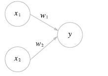
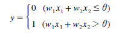
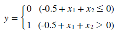
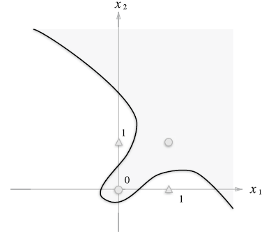
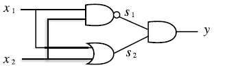
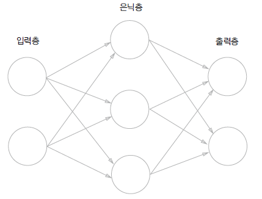

# Chapter 2. 퍼셉트론

## Perceptron 소개




위의 그림은 입력으로 2개의 신호를 받은 퍼셉트론을 구조화 시킨 것이다. x1, x2는 입력신호, y는 결과 신호, w1, w2는 각 뉴런의 가중치를 뜻한다. 그림의 원을 *뉴런* 또는 *노드*라고 하며 이러한 신호들이 뉴런에 보내질 때는 고유한 **가중치**가 곱해지게 된다.

**w1x1 + w2x2**는 각 신호의 총합을 나타내는 것으로 특정 임계값이 넘었을 때 *뉴런이 활성화 한다*라고 표기한다.



**퍼셉트론의 가중치**는 위와 같이 나타난다. 퍼셉트론은 입력신호 각각에 대해 고유한 가중치를 부여하며 가중치는 각 신호가 결과에 주는 영향력을 조절하는 요소로 가중치가 클 수록 해당 신호가 더 *중요하다*라는 것을 알 수 있다.


* * *


## Gate 구현


각 논리 게이트는 **AND, OR, NAND, XOR**등이 있다. 


```python
import numpy as np


def check(x):
    if x > 0: return 1
    else: return 0


def AND(x1, x2):
    W = np.array([0.5, 0.5])
    b = -0.6
    x = np.array([x1, x2])
    result = np.sum(W * x) + b

    return check(result)


def OR(x1, x2):
    W = np.array([1, 1])
    b = -0.4
    x = np.array([x1, x2])
    result = np.sum(W * x) + b
    
    return check(result)


def NAND(x1, x2):
    W = np.array([-0.5, -0.5])
    b = 0.9
    x = np.array([x1, x2])
    result = np.sum(W * x) + b
    
    return check(result)
```

위의 코드에서는 각각의 가중치가 전부 다르게 설정되어 있기는 하지만 각각의 **AND, OR, NAND** 게이트들을 구현할 수 있다. 


* * *


## 퍼셉트론의 한계

위에서 만든 gate code는 **AND, OR, NAND**가 전부이다. **XOR**는 다음과 같은 input, output 구조를 가진다.

|x1|x2||y|
|---|---|
|0|0||0|
|1|0||1|
|0|1||0|
|1|1||1|

위의 예제코드에서 작성한 weight값과 bias 값을 토대로 XOR 게이트의 수식을 한번 정의해보면 다음과 같이 나오게 된다.



쉽게말해서 1의 갯수가 홀수 개라면 1이 나오는 형식인데 이를 그래프로 나타내보면 선형으로 이뤄진 함수로 나누기는 불가능하다.


### 비선형 함수

따라서 XOR를 나타낼 때는 비선형 함수를 이용해야 한다. 



위와 같은 비선형 함수를 이용한다면 곡선으로 나뉘어진 비선형 영역 및 선형 영역을 나눠 XOR 상태를 나타낼 수 있다.


### 다층 퍼셉트론

비선형의 함수로도 표현하기 힘들다면 기존에 구현된 게이트를 조합하면 된다. 



위의 이미지처럼 NAND, OR, AND 게이트를 활용해 XOR 게이트를 구현할 수 있다.


### XOR gate 구현

예제코드에서 사용했던 각각의 구현된 게이트 코드를 이용해서 XOR를 구현할 수 있다.


```python
def XOR(x1, x2):
    t1 = NAND(x1, x2)
    t2 = OR(x1, x2)
    result = AND(t1, t2)
    
    return result
```

위와 같이 XOR gate를 구현할 수 있다.


# 신경망

신경망은 가중치 매개변수의 적절한 값을 데이터로부터 자동으로 학습하는 능력을 가진 구조이다. 


## 신경망의 구조



신경망은 **입력층, 은닉층, 출력층** 이 세개의 layer로 구성되며 


위와 같은 퍼셉트론이 있다고 가정하면 여기에 **편향 (b)** 을 더하여 나타난 것이 편향을 포함한 퍼셉트론이다. 그리고 특정 값을 넘으면 1, 넘지 못한다면 0으로 나타내는 함수를 *h(x)* 라고 한다면 퍼셉트론의 식을 다음과 같이 나타낼 수 있다.

*y = h(b + w1x1 + w2x2)*

*h(x) = 0 (x <= 0)*

*h(x) = 1 (x > 0)*


## 활성화 함수

위에서 *h(x)* 라는 함수가 나왔는데 이처럼 신호의 총합을 출력신호로 변환하는 함수를 **활성화 함수** 라고 칭한다. 


신경망에서 자주 사용하는 *sigmoid* 함수의 식이다. 단순한 함수이지만 input에 대해 항상 결과물을 0 ~ 1 사이의 값으로 출력한다. 


```python
import math
import numpy as np

def sigmoid(x):
    return 1 / (1 + np.exp(-x))

x = np.array([-1.0, 1.0, 3.0])

sigmoid(x)
```


    array([0.26894142, 0.73105858, 0.95257413])


위는 sigmoid 함수를 python code로 나타낸 결과이다. 결과는 0 ~ 1 사이로 나타나게 된다. 


```python
import matplotlib.pylab as plt

x = np.arange(-10, 10, 0.1)
y = sigmoid(x)

plt.plot(x, y)
plt.ylim(-0.1, 1.1)
plt.show()
```


sigmoid함수의 형태는 위와 같다. 단순히 계단형식으로 나타나는 활성화함수와는 달리 sigmoid 함수는 실수를 돌려주면서 더 자연스러운 흐름의 그래프 형태가 완성된다. 
